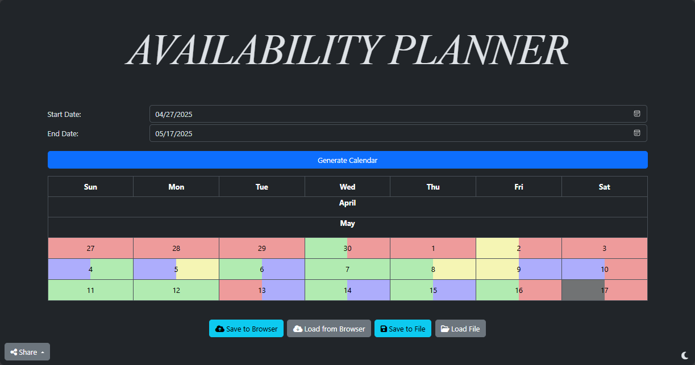
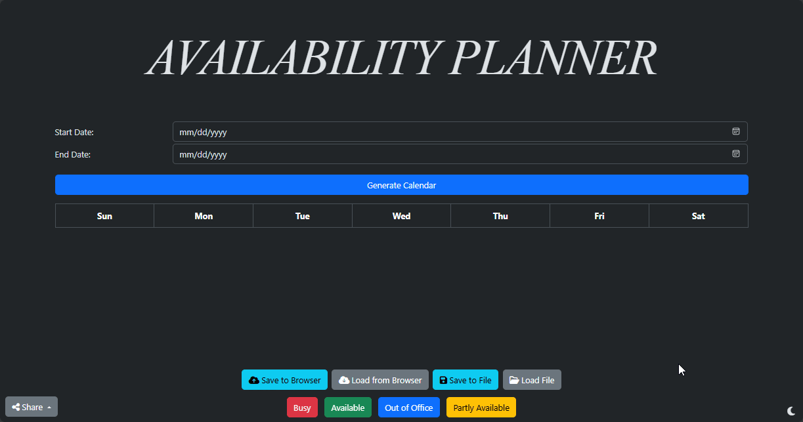

# 🗓️ Availability Planner

 

> Local website to decide availability over a given period, developed for personal use for planning events with friends.

## Features
- Start Date Picker
- Date Range or End Date Picker
- Interactive Background Preview of Availability
  - 4 Options for Availability
- Saves to JSON in Local Storage or as File
- Loads from Local Storage or File
- Mobile Support
- Beautiful Bootstrap Design
- Light/Dark Mode
- Check Availability Against Others

> This is a GIF of the website in action. It shows the theming, comparing availability, and loading from local storage.

## Next Steps

- Allow Availability Type Changes
- Improve Boundary Handling
- Improve Visuals
- Improve Exports
- Move to React?